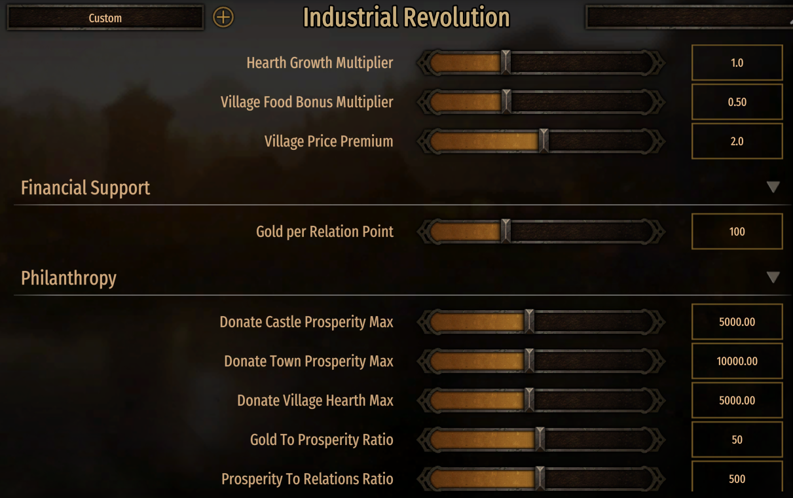

# Industrial Revolution



A quality-of-life and economy overhaul mod for Mount & Blade II Bannerlord, built to give you more ways to exchange resources — troops for gold, gold for relations, loot for XP, and more.

---

## Features

### Philanthropy
- **Donate gold** to towns, castles, or villages via menu option — adds to prosperity/hearths and gives a relations boost to notables. Ratios controllable by MCM sliders.
- **Rebuild razed villages** with the time and labour of your troops. About a day with 100 low-tier troops; faster with more or higher-tier troops. Partly-recovered villages take less time.

### Troop & Prisoner Exchange
- **Give troops to notables** in towns or villages via conversation — any troops, any number, added to militia with a relations/renown/power reward proportional to tier and quantity.
- **Sell troops** via menu option in villages or towns. Price is 20× troop level by default; multiplier controllable by MCM slider (range 0.1–2.0, default 0.5).
- **Sell prisoners** at villages and castles — sell all at once, or select via the exchange screen with a live gold ticker.

### Financial Support
- **Request financial support** from notables — sacrifice 20 relation points for 2,000 gold by default. Ratio controllable by MCM slider.

### Economy Adjustments
- **Construction scaling** now grows exponentially with gold in reserve — double the gold, double the speed (replaces the flat native boost).
- **Villages produce beyond 800 hearths**, providing more food and production to bound settlements. The 800-hearth cap in native capped food at +18; multiplier controllable by slider.
- **High-prosperity towns boost village hearth growth**, enabling a positive feedback loop for well-invested regions. Multiplier controllable by slider.
- **High-prosperity cities boost workshop output** — 2× at 6,000, 3× at 9,000, 4× at 12,000, etc.
- **Villages pay double price** for manufactured goods (Tools, Beer, Wine, Oil, Pottery, Cloth, Leather, Velvet, Jewelry) and horses. Reflects realistic town/village trade dynamics. Price multiplier controllable by slider; goods consumed at 25% of stock per day.
- **More gold in settlements** — villages hold 1,000 + (2 × Hearths); towns hold 100,000 + (50 × Prosperity). Makes trading with villages more worthwhile.
- **Starving towns slaughter livestock** for meat, and horses eventually.

### Discard XP
- **All discarded loot gives XP**, not just weapons and armour — based on gold value rather than tier. Default 0.5 gold value per XP point, controllable by MCM slider.
- **Paid in Promise** and **Giving Hands** perks on your Quartermaster each double XP gained (toggleable in MCM).

### Localisation
Full translation support for 11 languages, including all MCM settings:
English · German · French · Spanish · Brazilian Portuguese · Simplified Chinese · Traditional Chinese · Japanese · Korean · Polish · Russian · Turkish

---

## Requirements

| Mod | Purpose |
|-----|---------|
| [Harmony](https://www.nexusmods.com/mountandblade2bannerlord/mods/2006) | Core engine patches |
| [ButterLib](https://www.nexusmods.com/mountandblade2bannerlord/mods/2018) | Required by MCM |
| [UIExtenderEx](https://www.nexusmods.com/mountandblade2bannerlord/mods/2102) | Required by MCM |
| [Mod Configuration Menu v5+](https://www.nexusmods.com/mountandblade2bannerlord/mods/612) | In-game settings sliders and toggles |

---

## Recommended Load Order

```
[Native game modules]
Harmony
ButterLib
UIExtenderEx
Mod Configuration Menu
[Your other mods]
Industrial Revolution   ← place near the bottom
```

---

## Compatibility

**Built and tested on v1.3.x (current: 1.3.15).** Compatible with 1.2.x for most features. 1.4.x is untested; a rebuild against 1.4 DLLs will likely be required once that version stabilises in the mod community.

### Likely Compatible
Mods that do not alter core settlement logic, troop management, gold/trade, or loot-to-XP conversion — armories, cosmetic mods, UI overhauls, most total overhauls, and mods that edit characters, tournaments, or battle mechanics.

Personally tested without issues: Realm of Thrones, Empires of Europe 1100 + Eriks Troops, War Sails, Fourberie, Retinues, Improved Garrisons, Horses, Hot Butter, Character Reload, Character Manager, True Relations, Both Perks, Party AI Controls, Esoteric Knowledge, Champion's Relics, Tutelage, Bannerlord Expanded (Spouses & Settlement Interactions), and various armory mods.

### Likely Incompatible
Mods that alter economy or notable dialogue: **Banner Kings**, **Dramalord**, **True Town Gold**, and the original mods this was built from.

---

## Save Game Compatibility

- **Adding the mod:** safe to add to an existing save.
- **Removing the mod:** this mod does not inject custom variables into save files (all `SyncData` methods are intentionally empty). Removing it should seamlessly revert to native economy and construction formulas. Always back up saves before changing mods.

---

## Changelog

### v1.1.1
- MCM settings are now translated in all 11 supported languages
- Fixed: "Sell some prisoners" screen was not showing prisoners
- Fixed: Native gold ticker now shows on both sell prisoners and sell troops screens
- Troop sell price multiplier default lowered to 0.5 (range now 0.1–2.0)

### v1.1.0
- Added prisoner selling at villages and castles (sell all, or select via exchange screen)
- Full localisation for 11 languages

### v1.0.0
- Initial release

---

## Troubleshooting & Bug Reports

Please open a [GitHub issue](https://github.com/mithridatesvieupator/IndustrialRevolution/issues) with:
- Game version and full modlist + load order
- Nature of the crash or bug
- Screenshots or text of any error message
- Relevant extract from `C:\ProgramData\Mount and Blade II Bannerlord\logs\rgl_log.txt`
- [Better Exception Window](https://www.nexusmods.com/mountandblade2bannerlord/mods/2117) report if available

> I'm not a professional developer and have a full-time job, so responses may be slow. That said, detailed reports with logs go a long way — you could also try feeding them into an LLM yourself, rebuild from source, and submit a PR.

---

## Acknowledgements

Built to consolidate and expand on ideas from the Bannerlord modding community. Thanks to:

- [Give Troops to Notables](https://www.nexusmods.com/mountandblade2bannerlord/mods/673) by Lliud
- [The Philanthropist](https://www.nexusmods.com/mountandblade2bannerlord/mods/634) by Faraonj
- [Gold Rush Construction](https://www.nexusmods.com/mountandblade2bannerlord/mods/4360) by remosewa
- Food Demand Tweaks by moechar
- [MB2_Olto_Discard](https://www.nexusmods.com/mountandblade2bannerlord/mods/3724) by Oltopeteeh
- [Sell Your Troops](https://www.nexusmods.com/mountandblade2bannerlord/mods/3268) by bearTokken
